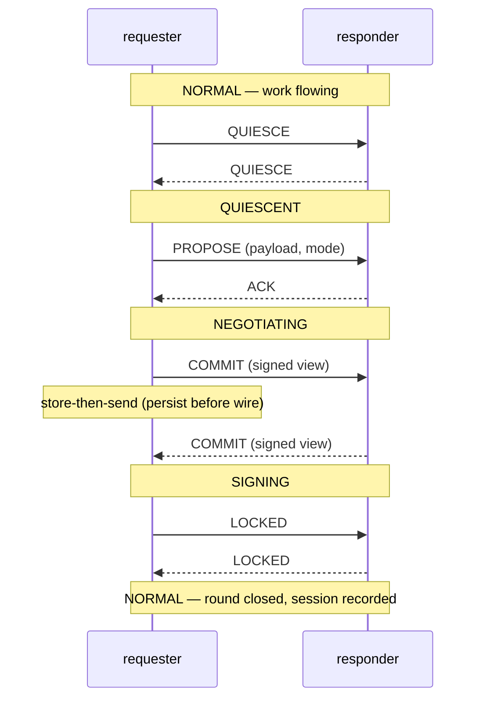

# S0 — two-party handshake: the happy path

The baseline every other scenario deviates from.
**The requester opens a session; the responder accepts; both sides
land in the same terminal state.**

Worked example for this repo's manuscript pattern — a generic
two-party protocol with quiesce, propose, ack, and confirm phases.

## Layered summary

**TL;DR**: The handshake completes end-to-end in one round.
Verified on the recorded run; all checks green.

**ELI5**: Two programs that want to cooperate first agree to pause
everything else they were doing, so the thing they build together
does not shift under them while they build it.
One proposes the change, the other agrees, they both write it down,
and each keeps proof the other wrote it down.
When the proof is complete on both sides, they resume normal work.
If either had crashed mid-way, the recorded proofs let them finish
or unwind safely instead of losing track.

**ELI junior developer, with context**:

- Mechanism: requester sends `QUIESCE` (both stop new work) →
  requester sends `PROPOSE` → responder replies `ACK` → both
  exchange `COMMIT` carrying the record of the agreed state →
  responder's `LOCKED` closes the round.
- Affected class: every session whose both ends reach
  `state == LOCKED` with matching `session_id`.
- Entry vs trigger: symmetric — acceptance at entry is the same
  predicate that guards the trigger.
- Tradeoffs: persist-before-wire was chosen over
  wire-then-persist (rejected: a crash after send but before store
  loses the only copy of the signed agreement — see S1).
- Regression surface: normal work between QUIESCE and LOCKED must
  still be answered correctly (the "both views live" window) — the
  counter-rail `mid-round-service` must not flip.
- Operations: one log line per phase at debug; operators watch for
  round ids that reach QUIESCE without LOCKED within the timeout.

**ELI senior developer / tradeoffs and nuances**:

- Invariant: between first `COMMIT` and mutual `LOCKED`, every
  concurrent update must satisfy ALL live state views
  (quote: Q-INV-1).
- Ordering: the poorer-side-signs-second rule removes the
  both-waiting deadlock class (quote: Q-ORD-2).
- Persistence budget: the store-before-wire fsync measured 14–70 ms —
  the substrate S1's replay path depends on.
- Not traced: reorg/retry of the underlying transport within the
  confirm window (out of scope; see S4 for the race shape).

## Sequence diagram

Source: generated from `timeline.jsonl` (run `R-20260916T1000Z`).

## Step table

| # | who→who | message/action | requester believes | responder believes | narration | can go wrong |
|---|---|---|---|---|---|---|
| 1 | R→P | QUIESCE | want a round | peer wants a round | `quiesce_send` | W1: round never proceeds → timeout policy |
| 2 | P→R | QUIESCE | both paused ✓ | both paused ✓ | `quiesce_recv` | |
| 3 | R→P | PROPOSE | round open | round open (accepter) | `round_open` | W2: mode disagreement → ABORT |
| 4 | P→R | ACK | terms agreed | terms agreed | `round_accept` | |
| 5 | R→P | COMMIT | I signed view-2 | requester signed view-2 | `commit_send` | **W3: crash after sign, before send → S1** |
| 6 | P→R | COMMIT | responder signed view-2 | I signed view-2 | `commit_send` | same, mirrored |
| 7 | both | LOCKED | new view ONLY | new view ONLY | `mutual_locked` | W4: racy locks on reconnect → S4 |
| 8 | both | session recorded | round closed | round closed | `round_close` | |

## Narration vocabulary

| Event | Emitted at | Meaning |
|---|---|---|
| `quiesce_send` | dispatch branch | why this branch: round requested |
| `quiesce_recv` | phase entry | peer quiesced |
| `round_open` | phase entry | negotiation started |
| `round_accept` | dispatch branch | terms accepted (inputs in the line) |
| `commit_send` | dispatch branch | signed view persisted, then sent |
| `mutual_locked` | terminal state | both sides hold only the new view |
| `round_close` | terminal state | session recorded, NORMAL resumed |
| `round_abort` | terminal state | round unwound (reason field) |

## Evidence

| Kind | Label | Locator |
|---|---|---|
| cell | 100/100 rounds LOCKED, 0 divergent | R-20260916T1000Z timeline.jsonl |
| cell | mid-round-service counter-rail: 42/42 answered | R-20260916T1000Z lanes/requester.log |
| source | store-then-send site | requester/session.rs:212 |
| lineage | stock-vs-fix A/B arms (for S1 film) | builds B-77/B-78 |
| transcript | design call on the persist rule | voice/segments.json @ 04:10–06:35 |

## Run manifest

- Run: R-20260916T1000Z
- requester @ a1b2c3d · responder @ e4f5a6b
- timeline-merger v3 · spec-quote verifier v2
- Corpus pins: main-spec @ pin-2026-09 (sha256 manifest)

## Deviation backlog (seeded by W-items)

| W | Scenario | Status |
|---|---|---|
| W3 | S1-crash-before-wire | filmed |
| W2 | S2-abort-with-wrong-reason | filmed |
| — | S3-park-and-resume | backlog |
| W4 | S4-reconnect-race | filmed |
| — | S5-duplicate-delivery | backlog |
